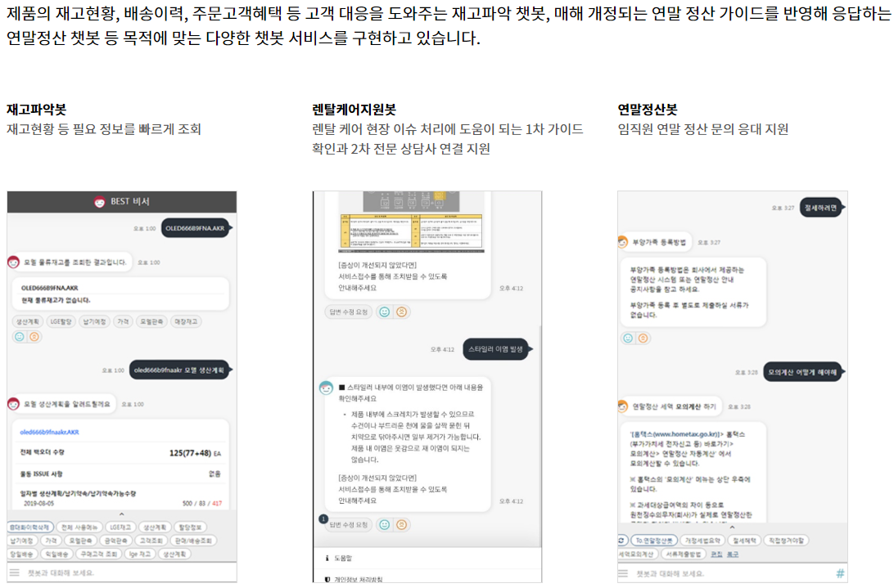
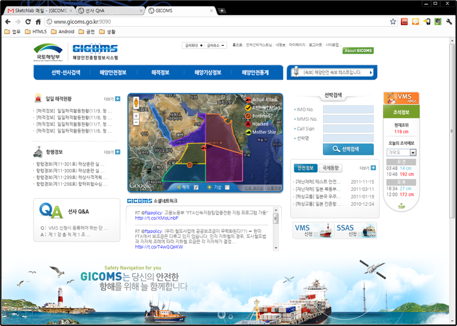
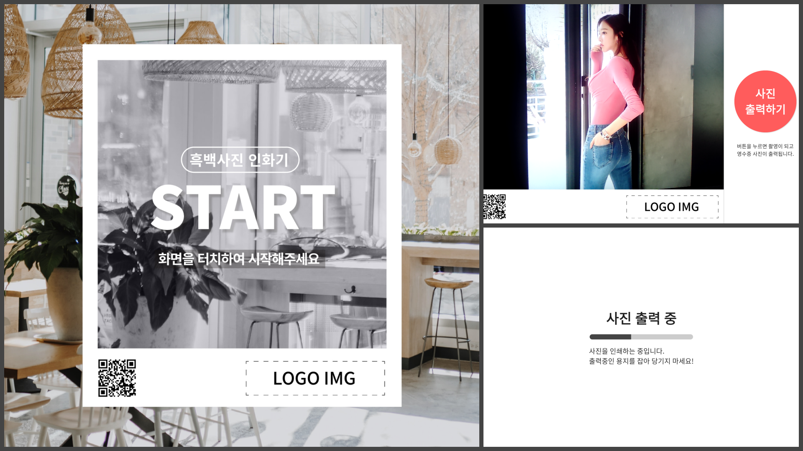
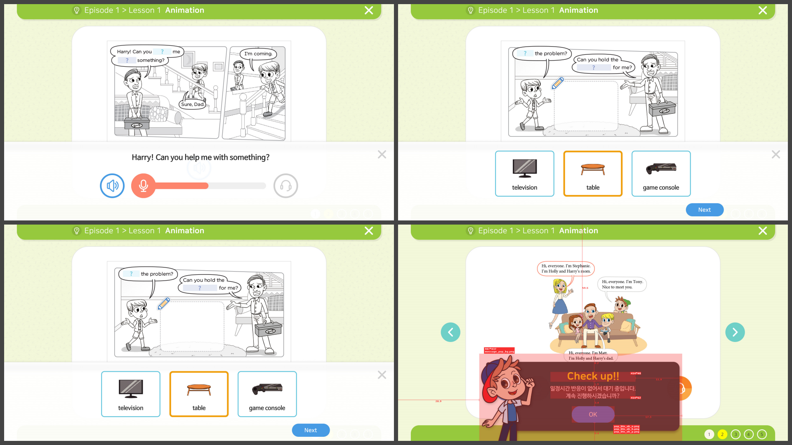
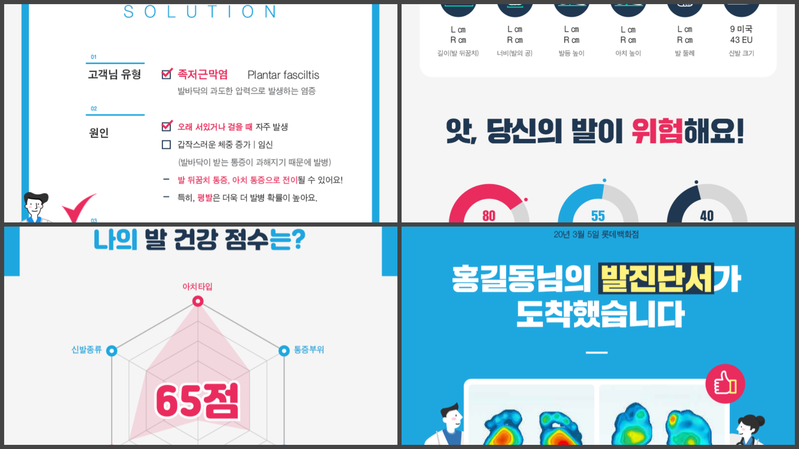

# My Work History

## 상주 / 재택 프로젝트

|Title|Period|Lang|Customer|Contractor|
|-----|------|--------|--------|----------|
|[LG CNS _EnTranslator_ 개발 (재택)](#lg-cns-entranslator-개발)|2023. 06 ~ 현재|React (Nextjs)|LG CNS|쉼|
|현대오토에버 _임직원몰_ 유지보수 (재택)|2022. 07 ~ 2022. 12|Java, Vuejs|현대오토에버|키트웍스|
|[LG CNS _VPA_ 유지보수 (재택)](#lg-cns-vpa-유지보수)|2022. 01 ~ 2022. 03|Java, React|LG CNS|쉼|
|SEMES|2021. 06 ~ 2021. 11|Java|SEMES|아이티사람들|
|삼성전기|2020. 09 ~ 2021. 01|Java|삼성전기|조앤소프트|
|삼성전자|2020. 04 ~ 2020. 09|Java|삼성전자|노벨알엔디|
|LG CNS _AI 빅데이터 플랫폼_|2019. 01 ~ 2019. 12|Java|LG CNS|누리꿈소프트|
|[아주캐피탈 _상담관리시스템_ 개발](#아주캐피탈-상담관리시스템-개발)|2018. 11 ~ 2018. 12|Java|아주캐피탈|엠티콤|
|[트레블메이트 전면개편 개발](#트레블메이트-전면개편-개발)|2018. 01 ~ 2018. 10|Java|트레블메이트|프레임아웃|
|[오스템임플란트 _DENALL_ 유지보수](#오스템임플란트-denall-유지보수)|2016. 06 ~ 2018. 01|Java|오스템임플란트|디지털플러스|
|나이스디앤비 _내부시스템_ 유지보수|2016. 02 ~ 2016. 05|Java|나이스디앤비|인비즈넷|
|[중외정보기술 _웹 ERP 시스템_ 개발](#중외정보기술-웹-erp-시스템-개발)|2015. 02 ~ 2016. 01|Java|중외정보기술|중외정보기술|
|[현대백화점 _SPIS_ 개발](#현대백화점-spis-개발)|2014. 09 ~ 2014. 11|Java|현대백화점||
|[한국공항공사 _전략적 인적자원개발(SHRD) 시스템 고도화_ 개발](#한국공항공사-전략적-인적자원개발shrd-시스템-고도화-개발)|2013. 08 ~ 2013. 12|Java|한국공항공사|(주)입소|
|[블루그리드 _웹접근성확보_ 프로젝트](#블루그리드-웹접근성확보-관련-개발)|2013. 05 ~ 2013. 07|Java|블루그리드|머스트플랜|
|[현대홈쇼핑 _Hmall 주민번호대체_ 개발](#현대홈쇼핑-hmall-주민번호대체-개발)|2013. 02 ~ 2013. 04|Java|현대홈쇼핑|머스트플랜|
|[디지캡 _uSBP (ucloud Security Broker Platform)_ 개발](#디지캡-usbp-ucloud-security-broker-platform-개발)|2012. 10 ~ 2013. 01|Java|디지캡|머스트플랜|
|[현대오토에버 _바츠아이티 고도화_ 개발](#현대오토에버-바츠아이티-고도화-개발)|2012. 08 ~ 2012. 09|Java|현대오토에버|엠로|
|11번가 _전세계배송관리시스템_ 개발|2012. 04 ~ 2012. 07|Java|11번가|머스트플랜|
|[국토해양부 해양안전종합정보시스템 _GICOMS_ 개발](#국토해양부-해양안전종합정보시스템-gicoms-개발)|2011. 08 ~ 2012. 03|Java|해양안전부|스캐치랩|
|Fendi _Promotion_ 개발|2011. 04 ~ 2011. 07|Java|FENDI|디베이션|
|[KB신용정보 _I-WIN_ 고도화 개발](#kb신용정보-i-win-고도화-개발)|2011. 01 ~ 2011. 03|Java|KB신용정보|KB신용정보|
|[TELKOM _FullTrek_ 유지보수](#telkom-fulltrek-유지보수)|2010. 06 ~ 2010. 12|Java|Telkom|Uangel|
|[영재교육종합데이터베이스 _GED (Gifted Education Database)_ 개발](#영재교육종합데이터베이스-ged-gifted-education-database-개발)|2010. 05 ~ 2010. 06|Java|한국교육개발원||
|웹투게더 _물류 ERP 시스템_ 유지보수 및 개발|2006. 06 ~ 2009. 12|Java|웹투게더|웹투게더|

### 상주 / 재택 프로젝트 상세

#### LG CNS EnTranslator 개발

- 기간: 2023. 06 ~ 2025. 03
- 발주사: LG CNS
- 수행사: LG CNS
- 계약사: 쉼

1. React 프론트엔드 개발 요청을 받았을 때, Nextjs를 사용하기로 생각 (서버 기능도 사용 및 배포까지)
2. App router 는 출시 된지 얼마 안되었기에, Page router 로 진행
3. 대형 프로젝트는 아니기 때문에, 컴포넌트의 구조를 단순화 함
4. 구현이 복잡한 기능에만 추가 라이브러리를 사용
5. LG 에너지 솔루션 완료 후, LG 전자등에 추가 (유지보수)

#### LG CNS VPA 유지보수

- 기간: 2022. 01 ~ 2022. 03 (현재)
- 발주사: LG CNS
- 수행사: LG CNS
- 계약사: 쉼

#### 아주캐피탈 _상담관리시스템_ 개발

- 기간: 2018. 11 ~ 2018. 12
- 발주사: 아주캐피탈
- 수행사: 엠티콤
- 계약사: 엠티콤

1. 상담사들의 상담내역을 분석하여 상담품질을 자동 관리하는 시스템
2. 엠티콤 자체 STT 엔진 API 연동
3. 주로 html, javascript의 프론트엔드 부분을 작업

#### 트레블메이트 전면개편 개발

- 기간: 2018. 01 ~ 2018. 10
- 발주사: 트레블메이트
- 수행사: 프레임아웃
- 계약사: 프레임아웃

1. ASIS ASP에서 TOBE JAVA로 개편 프로젝트
2. 주로 상품전시에 관련하여 프론트 및 관리자부분 작업, 네이버 페이 적용
3. 진행중에 프레임워크와 개발팀이 변경됨
4. _변경됨 프레임워크 소스의 상태는 괜찮은편, Maven등의 빌드툴 적용됨_
5. [Privatae Repo](https://github.com/sayingu/travlemate)

#### 오스템임플란트 _DENALL_ 유지보수

- 기간: 2016. 06 ~ 2018. 01
- 발주사: 오스템임플란트
- 수행사: 오스템임플란트
- 계약사: 디지털플러스

1. 사이트 유지보수 및 정기배송 기능 추가
2. [Privatae Repo](https://github.com/sayingu/eos)

#### 중외정보기술 _웹 ERP 시스템_ 개발

##### (주)한국TEI 모발분석결과시스템 구축

- 기간: 2015. 02 ~ 2015. 03
- 발주사: (주)한국TEI
- 수행사: 중외정보기술

1. 기존 시스템(IMES)이 존재하고, 프로젝트 히스토리는 자세히 알수는 없었으나, 주니어 개발자와 함께 프로젝트 마무리
2. 양식지에 출력을 하는 기능이 있었는데(모발인식결과), 오픈소스 리포팅 라이브러리인 [Jasper Report](https://community.jaspersoft.com/) 로 제작함

##### 금양 ERP 구축

- 기간: 2015. 04 ~ 2016. 01
- 발주사: 금양 ERP
- 수행사: 중외정보기술

1. Spring framework 의 기본적일 설정을 완료함(Spring Security까지 적용)
2. 서버의 WAS (Tomcat) 설치, Jenkins 를 통한 CI/DI 까지 설치 및 설정

#### 현대백화점 _SPIS_ 개발

- 기간: 2014. 09 ~ 2014. 11
- 발주사: 현대백화점
- 수행사:
- 계약사: 세종데이터시스템

1. 현대백화점의 VIP 고객 관리 시스템 개발
2. ~~지금 확인해 보니깐 퍼블리셔로 투입되어 있네?~~

#### 한국공항공사 _전략적 인적자원개발(SHRD) 시스템 고도화_ 개발

- 기간: 2013. 08 ~ 2013. 12
- 발주사: 한국공항공사
- 수행사: (주)입소
- 계약사: 이랜서

1. 주로 보고서 파일(mrd)의 오류 수정 및 개발을 담당
2. 리포트 디자이너 라는 툴로 작업 하였고, 현재는 클립소프트의 클립 리포트
3. ~~eHRD 포탈의 디자인 변경도 함께 진행한듯~~

#### 블루그리드 _웹접근성확보 관련_ 개발

- 기간: 2013. 05 ~ 2013. 07
- 발주사: 다수
- 수행사: 블루그리드
- 계약사: 머스트플랜

1. 웹접근성 인증이 필요한 사이트들에(주로 공공기관) 웹접근성 툴을 이용, 필요한 부분 수정
2. 주로 이미지 관련 수정이 많았음, _alt 태그 삽입 등_

#### 현대홈쇼핑 _Hmall 주민번호대체_ 개발

- 기간: 2013. 02 ~ 2013. 04
- 발주사: 현대홈쇼핑
- 수행사: 머스트플랜
- 계약사: 머스트플랜

1. 사이트내에 주민번호를 전부 삭제

#### 디지캡 _uSBP (ucloud Security Broker Platform)_ 개발

- 기간: 2012. 10 ~ 2013. 01
- 발주사: 디지캡
- 수행사: 머스트플랜
- 계약사: 머스트플랜

1. ucloud 보안 관리 플랫폼

#### 현대오토에버 _바츠아이티 고도화_ 개발

- 기간: 2012. 08 ~ 2012. 09
- 발주사: 현대오토에버
- 수행사: 엠로
- 계약사: 엠로

1. Maven등의 빌드 도구 미사용, 기본 설정은 .vscode/settings.json 참조
2. ~~제공된 샘플소스의 상태가...~~ [Private Repo](https://github.com/sayingu/vaatzit-sample)

#### 국토해양부 해양안전종합정보시스템 _GICOMS_ 개발

- 기간: 2011. 08 ~ 2012. 03
- 발주사: 국토해양부
- 수행사: GMT
- 계약사: 스케치랩

1. 하기 사항 직접 Setting
2. 전자정부 프레임워크 1.0.0
3. Maven 빌드
4. 세계 기상정보 및 해적 정보 표출을 위해 Google map api 적용
5. 소셜 네트워크 연동을 위해 `jquery.twitter.js v1.5` `jquery.neosmart.fb.wall.js v1.2.7` 사용
6. 국내 기상정보 웹서비스 적용
7. 통계 그래프 및 태풍 위치정보 서비스를 위해 adobe flash 10 버전 적용

#### KB신용정보 _I-WIN_ 고도화 개발

- 기간: 2011. 01 ~ 2011. 03
- 발주사: KB신용정보
- 수행사: KB신용정보
- 계약사: 이랜서

1. Maven등의 빌드 도구 미사용, 기본 설정은 .vscode/settings.json 참조
2. Java version: 1.4
3. JSP 프로젝트
4. EUC-KR 인코딩
5. [Private Repo](https://github.com/sayingu/2011.KBCI.01.I-WIN)

#### TELKOM _FullTrek_ 유지보수

- 기간: 2010. 06 ~ 2010. 12
- 발주사: 인도네시아 TELKOM (현재 FullTrek 서비스는 종료)
- 수행사: 유엔젤 (분당 위치)
- 계약사: 이랜서

1. [Apache Axis2](https://axis.apache.org/axis2/java/core/index.html)
2. 음반사로 부터 음원 다운로드 및 사용자 스트리밍 관련 기술

#### 영재교육종합데이터베이스 _GED (Gifted Education Database)_ 개발

- 기간: 2010. 05 ~ 2010. 06
- 발주사: 한국교육개발원
- 수행사:
- 계약사: 이랜서

1. Maven등의 빌드 도구 미사용, 기본 설정은 .vscode/settings.json 참조
2. JSP 프로젝트
3. EUC-KR 인코딩
4. [Private Repo](https://github.com/sayingu/kedi_ged)

## 도급 프로젝트 (Shym)

|Title|Period|Lang|Customer|
|-----|------|--------|--------|
|[ITI _SMB_ 개발 및 유지보수](#iti-smb-개발-및-유지보수)|2021. 12 ~ 현재|Java|ITI|
|[영인터내셔널 _모니터링 웹 등_ 개발 및 유지보수](#영인터내셔널-모니터링-웹-등-개발-및-유지보수)|2021. 01 ~ 현재|Java, React|영인터내셔널|
|ValueMark _인트라넷_ 고도화 개발|2023. 03 ~ 2023. 05|Java, React|퓨처솔루션|
|에이치에스씨엠티 _C-Water NAVI_ 유지보수|2022. 02 ~ 2022. 05|Java|에이치에스씨엠티|
|LG CNS _Hybrid Agile 대쉬보드_ 유지보수|2021. 11 ~ 2021. 12|React|LG CNS|
|_ParkB Back-Office_ 추가 개발|2021. 04 ~ 2021. 05|Java|한국스플라주식회사|
|[잉글리쉬에그 _디지털러닝_ 개발](#잉글리쉬에그-디지털러닝-개발)|2021. 01 ~ 2021. 04|React|기반|
|[워킹마스터 _CRM_ 개발](#워킹마스터-crm-개발)|2020. 04 ~ 2021. 04|Java|나인투식스|
|_인천공항 출도착 모니터링 웹_ 개발 [Private Repo](https://github.com/sayingu/icn-airport)|2020. 02 ~ 2020. 02|Java|개인|
|SKT _Jebo Now_ 개발|2019. 12 ~ 2020. 01|Java|오키도키|
|_홍대 시디과 졸업 Hive Mind_ 개발 [Private Repo](https://github.com/sayingu/hive-mind-2019)|2019. 12 ~ 2019. 12|HTML, CSS|개인|
|LG전자 _ACP5_ 유지보수 [Private Repo](https://github.com/sayingu/coldchain)|2019. 04 ~ 2019. 06|Express, Angular||

### 도급 프로젝트 (Shym) 상세

#### ITI _SMB_ 개발 및 유지보수

- 기간: 2021. 12 ~ 현재 (약 6개월에 1회성)
- 발주사: [ITI TECH](https://ititech.co.kr/)

1. SMB 개요: 스마트 병원 구축을 위한 타블릿 앱의 백엔드 및 관리자 개발 및 유지보수
2. 삼성서울병원 백엔드 및 관리자 개발
3. SMB 유지보수
4. Private Repos
    - [SMB Standard Api](https://github.com/ititech/SMB_Standard_Api)
    - [SMB Standard Web](https://github.com/ititech/SMB_Standard_Web)
    - [SMB 삼성서울병원 Api](https://github.com/ititech/smb_samsung_idc)
    - [SMB 삼성서울병원 Web](https://github.com/ititech/smb_samsung_web)
    - [SMB 삼성서울병원 App](https://github.com/ititech/SMB_Android_Samsung_Seoul)
    - [SMB 삼성서울병원 Test App](https://github.com/ititech/SMB_Android_Samsung_Seoul_Test)
    - [SMB 삼성서울병원 Websocket Test](https://github.com/sayingu/smb-samsung-socket-sample)

#### 영인터내셔널 _모니터링 웹 등_ 개발 및 유지보수

- 기간: 2021. 01 ~ 현재 (약 3개월에 1회성)
- 발주사: [영인터내셔널](https://youngint.com/)

1. 전국 스티커출력 기계 관리시스템
2. 스티커출력 기계(폴라폴라 스티커 제작소)
3. 폴라코드 관리시스템 [Private Repo](https://github.com/YoungInt/igloo-admin)
4. 영수증출력 앱 (안드로이드) [Private Repo](https://github.com/sayingu/yrp)

#### 잉글리쉬에그 _디지털러닝_ 개발

- 기간: 2021. 01 ~ 2021. 04
- 발주사: 잉글리쉬에그
- 수행사: 기반

1. 초등대상 디지털러닝 사이트 프로토타입
2. [Konva 라이브러리](https://konvajs.org/index.html)를 사용하여 말풍선표시, 퀴즈표시등을 처리
3. [Private Repository](https://github.com/sayingu/englishegg)

#### 워킹마스터 _CRM_ 개발

- 기간: 2020. 04 ~ 2021. 04
- 발주사: 나인투식스

1. 발사이즈를 측정한 고객에게 결과 보고서를 카톡(알림톡), 문자 등으로 발송
2. 발송 대행사는 [비즈뿌리오](https://www.bizppurio.com/)를 사용
3. AWS 배포 설정
4. ~~일정을 제대로 맞추지 못했음 🙏~~
5. [Private Repository](https://github.com/WalkingMaster/wmclub-admin)

## 기타

|Title|Description|Lang|
|-----|------|--------|
|대학 과제 도움 [Private Repo](https://github.com/sayingu/college-exams)|알고리즘, 언어기초, 프로젝트 등|C++, Python, Java|
|Sneat - Admin Template [Private Repo](https://github.com/sayingu/materialize-admin-v12.5.0)|[Materialize 어드민 템플릿](https://demos.themeselection.com/sneat-bootstrap-html-admin-template-free/html/), 어드민 기본 디자인으로 사용|Html, React|
